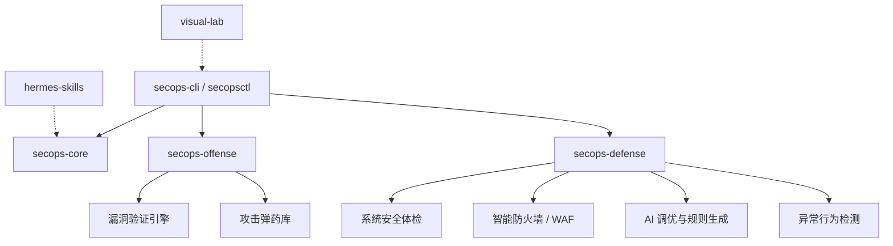

# SecOps 自动化安全运维工具箱 v3.0.0

> 渗透测试 + 系统维护 + 智能防御 + 漏洞检测

> [!WARNING]
> **免责声明 (Disclaimer)**
> 
> 本项目 (`cybersecurity-ops`) 包含的所有工具、脚本及攻击模块仅供**授权的安全测试**、**防御演练**、**CTF 竞赛**以及**网络安全教育**用途。
> 
> 未经事先双方同意，使用本工具对任何目标进行攻击测试均属于非法行为。开发者及贡献者不对任何人因滥用本项目引发的任何直接或间接后果承担任何法律及连带责任。请务必在当地法律和相关网络安全法规的允许范围内合法使用。
## 架构



## 安装

```bash
# 开发模式安装（推荐）
pip install -e secops-core/
pip install -e secops-offense/
pip install -e secops-defense/
pip install -e secops-cli/

# 或一键安装
pip install -e .

# Docker 方式
make docker
make docker-up
```

## 使用

### 交互式菜单
```bash
secops
```

### 命令行直接调用
```bash
# 安全体检
secops --check                          # 系统安全体检
secops --harden                         # 一键加固

# 漏洞扫描
secops --attack https://target.com      # 漏洞验证引擎
secops --waf https://target.com         # WAF 指纹检测

# 防御功能
secops --update-firewall                # 更新防火墙与威胁情报
secops --anomaly                        # 异常行为检测
secops --intel                          # 威胁情报摘要

# 定时任务
secops --cron-check                     # 执行定时巡检
```

### Python 库调用
```python
# 渗透测试
from secops_offense.attack_engine import AttackEngine
engine = AttackEngine("https://target.com")
engine.authorize()
engine.run_all(modules=["xss", "sqli", "ssrf", "xxe", "rce", "nosqli", "jwt", "idor", "cors", "redirect"])
engine.report()

# WAF 检测
from secops_defense.waf import detect_waf
wafs = detect_waf("https://target.com")

# 系统维护
from secops_defense import evaluator
data = evaluator.run_evaluation()
print(f"安全评分: {data['score']}/100")

# 异常检测
from secops_defense.anomaly import run_anomaly_detection
anomalies = run_anomaly_detection()

# 威胁情报
from secops_defense.threat_intel import get_threat_summary
summary = get_threat_summary()
```

## 子项目说明

| 子项目 | 职责 | 核心模块 |
|--------|------|---------|
| secops-core | 共享内核 | config, logger, utils, http_client, github_client |
| secops-offense | 渗透测试 | attack_engine (17种检测器), arsenal, github_offense |
| secops-defense | 系统维护 | evaluator, hardener, firewall, cron, reporter, waf, anomaly, threat_intel |
| secops-cli | 统一入口 | main (路由到 offense/defense) |

## 支持的漏洞类型 (17种)

### 进攻模块

| 检测器 | 说明 | 严重程度 |
|--------|------|---------|
| XSS | 反射型/存储型跨站脚本 | high |
| SQLi | 报错型/布尔盲注/时间盲注 | critical |
| SSTI | 模板注入 (Jinja2/Twig/FreeMarker) | critical |
| LFI | 本地文件包含/路径穿越 | critical |
| SSRF | 服务端请求伪造 | critical |
| XXE | 外部实体注入 | critical |
| RCE | 命令注入 | critical |
| NoSQLi | MongoDB/Redis 注入 | critical |
| InfoLeak | 敏感路径/调试接口泄露 | medium |
| JWT | JWT 漏洞 (算法混淆/弱密钥) | critical/high |
| IDOR | 不安全的直接对象引用 | high |
| CORS | 跨域资源共享漏洞 | medium/high |
| Open Redirect | 开放重定向 | medium |

### 防御模块

| 模块 | 说明 |
|------|------|
| WAF 检测 | 17种国内外 WAF 指纹识别 + 绕过测试 |
| 异常检测 | 暴力破解/可疑进程/未授权密钥 |
| 威胁情报 | 6源聚合 + 信誉评分 + 本地缓存 |

## 防火墙功能

- **多源威胁情报**: stamparm/ipsum, blocklist, firehol, binarydefense, cinsscore, emergingthreats
- **智能规则管理**: 端口保护、管理员白名单、暴力破解防护
- **原子重载**: nftables 规则原子更新，避免服务中断
- **完整审计**: 自动检测高危端口、配置风险

## Docker 部署

```bash
# 构建镜像
make docker

# 启动服务 (含 DVWA 靶机)
make docker-up

# 扫描靶机
make docker-scan

# 停止服务
make docker-down
```

## 快速开始 (Deploy Demo Tenant)

```bash
# 1. 初始化项目与依赖 (一键安装)
pip install -e .

# 2. 生成租户配置模板
secopsctl init --demo > tenant-demo.yaml

# 3. 部署租户防御体系与检测计划
secopsctl deploy tenant-demo.yaml
```

## 参考文档 (References)

- [CTF 竞赛辅助指南](references/competition.md)
- [防火墙自动更新设计](references/firewall-setup.md)
- [GitHub 自动化威胁情报提取](references/github-intel.md)
- [Hermes Agent 技能集成](references/hermes-integration.md)
- [Mimocode 集成设计](references/mimocode-integration.md)
- [沙盒自动化测试体系](references/sandbox-testing.md)
- [服务器运维专家系统](references/server-ops.md)

## 目录结构

```
secops-core/
└── secops_core/
    ├── config.py          # 统一配置
    ├── logger.py          # 统一日志
    ├── utils.py           # 基础工具
    ├── http_client.py     # HTTP 封装
    └── github_client.py   # GitHub 拉取

secops-offense/
└── secops_offense/
    ├── attack_engine/     # 漏洞验证引擎 (模块化)
    │   ├── auth.py        # 授权门禁
    │   ├── finding.py     # 漏洞数据结构
    │   ├── engine.py      # 主引擎
    │   └── modules/       # 17种检测器
    │       ├── xss.py     # XSS 检测
    │       ├── sqli.py    # SQL 注入
    │       ├── ssti.py    # 模板注入
    │       ├── lfi.py     # 文件包含
    │       ├── ssrf.py    # 服务端请求伪造
    │       ├── xxe.py     # 外部实体注入
    │       ├── rce.py     # 命令注入
    │       ├── nosqli.py  # NoSQL 注入
    │       ├── infoleak.py # 信息泄露
    │       ├── jwt.py     # JWT 漏洞
    │       ├── idor.py    # IDOR 漏洞
    │       ├── cors.py    # CORS 漏洞
    │       └── redirect.py # 开放重定向
    ├── arsenal.py         # 弹药库
    ├── github_offense.py  # GitHub payload 学习
    └── online_scanner.py  # 在线扫描

secops-defense/
└── secops_defense/
    ├── evaluator.py       # 系统安全体检
    ├── hardener.py        # 一键加固
    ├── firewall.py        # 防火墙管理
    ├── github_intel.py    # 威胁情报
    ├── cron.py            # 定时巡检
    ├── reporter.py        # 运维报告
    ├── waf.py             # WAF 检测与绕过
    ├── anomaly.py         # 异常行为检测
    ├── threat_intel.py    # 威胁情报聚合
    ├── templates/         # 报告模板
    └── scripts/           # 运维脚本

secops-cli/
└── secops_cli/
    └── main.py            # 统一入口 + 菜单路由
```

## 测试

```bash
# 运行所有测试
make test

# 或手动运行
python -m unittest discover -s secops-core/tests -v
python -m unittest discover -s secops-offense/tests -v
python -m unittest discover -s secops-defense/tests -v
```

## 许可证

MIT License
